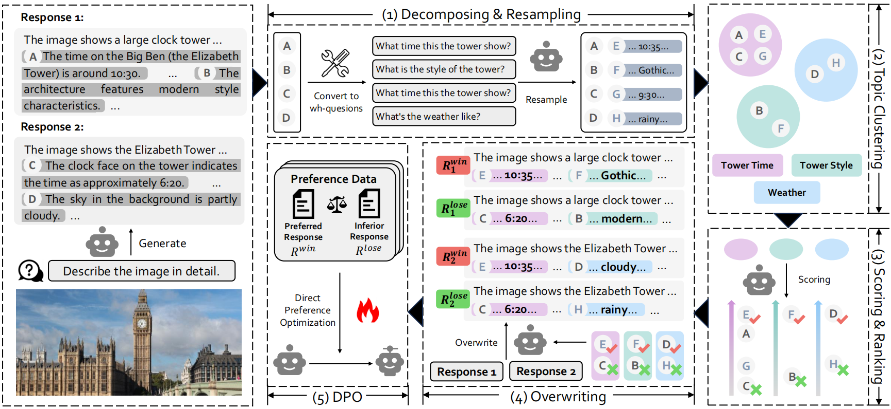
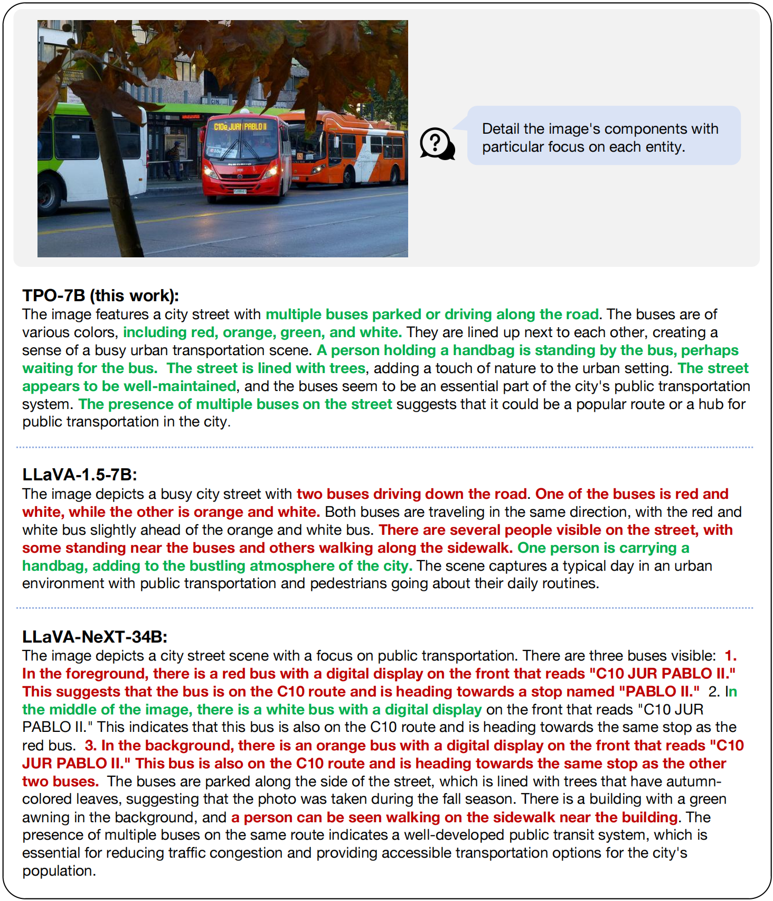
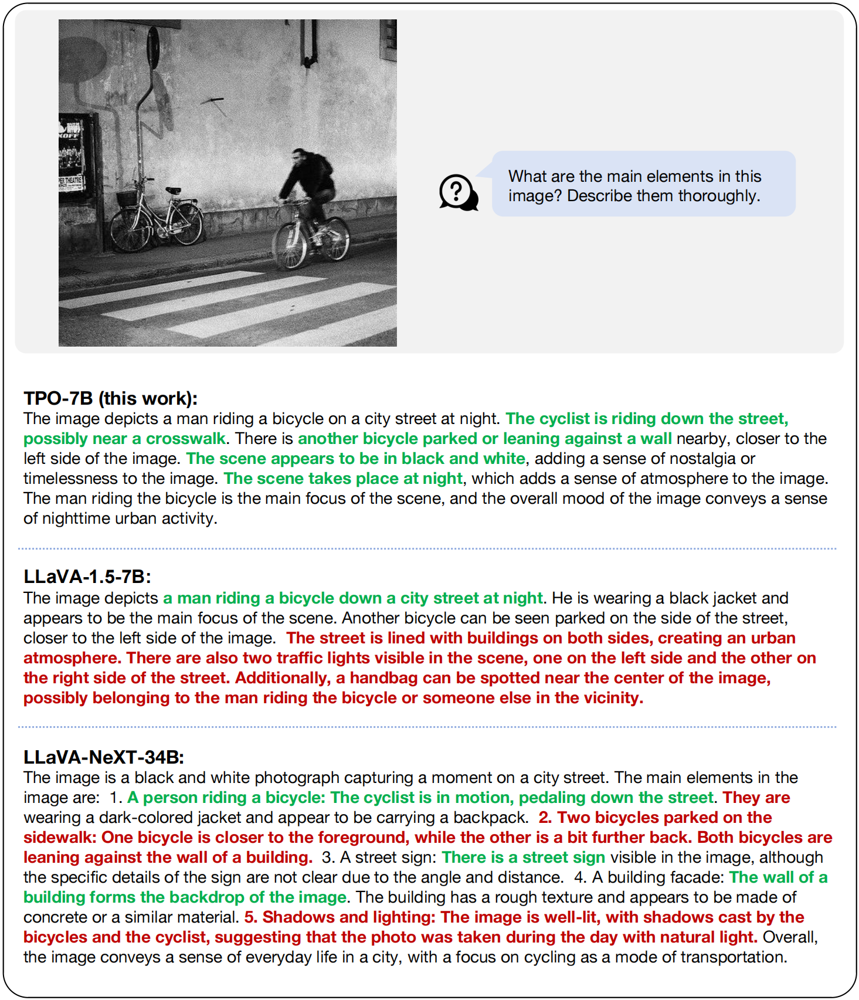

<div align="center" style="font-size: 15pt">

# A Topic-level Self-Correctional Approach to Mitigate Hallucinations in MLLMs

</div>

<h4 align="center"> 

  [Lehan He](https://scholar.google.com/citations?hl=en&user=vWYG3zIAAAAJ),
  [Zeren Chen](https://scholar.google.com.hk/citations?hl=en&user=fdDOA-0AAAAJ),
  [Zhelun Shi](https://scholar.google.com/citations?user=EDLcoVkAAAAJ&hl=en),
  [Tianyu Yu](https://github.com/yiranyyu),

  [Jing Shao](https://amandajshao.github.io/),
  [Lu Sheng](https://lucassheng.github.io/)

</h4>

<div align="center" style="font-size: 15pt">

<a href='https://arxiv.org/abs/2411.17265'></a>
<a href='https://huggingface.co/datasets/helehan/topic-overwrite'></a>
<a href='https://huggingface.co/helehan/topic-overwrite-llava-7b-full'></a>
<a href='https://huggingface.co/helehan/topic-overwrite-llava-7b-lora'></a>

</div>

## 🎉 News <!-- omit in toc -->

- [2024.12.08] We open-source the code, weights ([7B](https://huggingface.co/helehan/topic-overwrite-llava-7b-full), [Lora](https://huggingface.co/helehan/topic-overwrite-llava-7b-lora)) and [data](https://huggingface.co/datasets/helehan/topic-overwrite) of TPO!
- [2024.11.26] Our paper is accesible at [arXiv](https://arxiv.org/abs/2405.17220) now!


## 📜 Overview <!-- omit in toc -->

We propose a topic-level self-correctional paradigm tailored for reducing hallucinations, Topic-level Preference Overwriting (TPO). We adopt a deconfounded algorithm that replaces all topics involved in a complex response, with the best or worst alternatives resampled multiple times from the reference model itself on the same topic.

<table align="center">
    <p align="center">
      
    </p>
</table>


## Prepare <!-- omit in toc -->

1. Install some important packages.

```bash
conda create -n tpo python=3.10 -y
conda activate tpo
pip install -r requirements.txt
```

2. Download Model Weights

    [llava-7b-full](https://huggingface.co/helehan/topic-overwrite-llava-7b-full)
    [llava-7b-lora](https://huggingface.co/helehan/topic-overwrite-llava-7b-lora)


## Inference

We provide a simple example to show how to use TPO.


```python
from chat import TPOChat, img2base64

chat_model = TPOChat('helehan/topic-overwrite-llava-7b-full')
image_path="Your_Image_Path.jpg"
msgs = "Describe in detail the people in the picture."
inputs = {"image": image_path, "question": msgs}
answer = chat_model.chat(inputs)
print(answer)
```

You can also run this code to inference by executing the following script:

```bash
python chat.py
```

## Train

**1. Prepare data**

```python
from datasets import load_dataset
data = load_dataset("helehan/topic-overwrite")
```

**2. Download model from [LLaVA](https://huggingface.co/liuhaotian/llava-v1.5-7b) and vision tower [CLIP](https://huggingface.co/openai/clip-vit-large-patch14-336)**

**3. Training**

Run the following command to start training.

```bash
# If you want to train lora
bash script/train/llava15_train_lora.sh ./llava-v1.5-7b-checkpoint-path ./TPO-data-path

# If you want to train full
bash script/train/llava15_train_main.sh ./llava-v1.5-7b-checkpoint-path ./TPO-data-path
```

## Data Generation 

If you prefer to manually generate the dataset rather than using the existing datasets on Hugging Face, please download [Llama](meta-llama/Meta-Llama-3-8B-Instruct) and run the following program.

```bash
# Remember to adjust the model path in the script
bash script/data_gen/data_pipeline_main.sh
```

## Evaluation

During evaluation, object-halbench/mmhal-bench/llava-bench need to be assessed using GPT-3.5/4.

### Object-HalBench

1. Download data from [COCO](http://images.cocodataset.org/annotations/annotations_trainval2014.zip)

2. Download eval supplement model in python

```python
import nltk
nltk.download('wordnet')
nltk.download('punkt')
```

3. Download eval supplement model in terminal

```bash
python -m spacy download en_core_web_trf
```

4. Eval model

```bash
python script/eval/eval_objhal.sh [ckpt_path] [base_path if use lora ckpt else "No"] [YOUR_OPENAI_API_KEY]
```

We default use **gpt-3.5-turbo-0125**, Please replace {YOUR_OPENAI_API_KEY} with a valid OpenAI api-key or directly modify the [13th](https://github.com/topic-overwrite/topic-level-overwrite/blob/main/eval/gpt4_grpc.py#L13) line in eval/gpt4_grpc.py.

### MMHal-Bench

1. Download data from [MMHal-Bench](https://drive.google.com/file/d/1mQyAbeGgRyiVV6qjVkUI1uY_g9E-bDTH/view?usp=sharing).

2. Eval model

```bash
python script/eval/eval_mmhal.sh [ckpt_path] [base_path if use lora ckpt else "No"] [YOUR_OPENAI_API_KEY]
```

We default use **gpt-4-1106-preview**, Please replace {YOUR_OPENAI_API_KEY} with a valid OpenAI api-key or directly modify the [13th](https://github.com/topic-overwrite/topic-level-overwrite/blob/main/eval/gpt4_grpc.py#L13) line in eval/gpt4_grpc.py.

### AMBER

1. Download AMBER [data](https://github.com/junyangwang0410/AMBER/tree/master) and [image](https://drive.google.com/file/d/1MaCHgtupcZUjf007anNl4_MV0o4DjXvl/view?usp=sharing)

2. Download eval supplement model in terminal

```bash
python -m spacy download en_core_web_lg
```

3. Eval model

```bash
python script/eval/eval_amber.sh [ckpt_path] [base_path if use lora ckpt else "No"]
```

### MMSTAR

1. Download data from [MMSTAR](dataset/llava_bench/rule.json).

2. Eval model

```bash
python script/eval/eval_mmstar.sh [ckpt_path] [base_path if use lora ckpt else "No"]
```

### LLaVA-Bench

1. Download data from [LLaVA-Bench](https://huggingface.co/datasets/lmms-lab/llava-bench-in-the-wild).

2. Eval model

```bash
python script/eval/eval_llavabench.sh [ckpt_path] [base_path if use lora ckpt else "No"] [YOUR_OPENAI_API_KEY]
```

We default use **gpt-4-1106-preview**, Please replace {YOUR_OPENAI_API_KEY} with a valid OpenAI api-key or directly modify the [13th](https://github.com/topic-overwrite/topic-level-overwrite/blob/main/eval/gpt4_grpc.py#L13) line in eval/gpt4_grpc.py.


## Dialogue Examples

<div align="center">
  
</div>

<div align="center">
  
</div>


## Licenses <!-- omit in toc -->

[](https://github.com/tatsu-lab/stanford_alpaca/blob/main/LICENSE)
[](https://github.com/tatsu-lab/stanford_alpaca/blob/main/DATA_LICENSE)

**Usage and License Notices**: The data, code, and checkpoint are intended and licensed for research use only. They are also restricted to uses that follow the license agreement of LLaMA, Vicuna, and ChatGPT. The dataset is CC BY NC 4.0 (allowing only non-commercial use) and models trained using the dataset should not be used outside of research purposes.


## Acknowledgement <!-- omit in toc -->

- [RLAIF-V](https://github.com/RLHF-V/RLAIF-V): The codebase we built upon.
- [LLaVA](https://github.com/haotian-liu/LLaVA): The instruction model and labeler model of RLAIF-V-7B.


## Citation

```bibtex
@article{he2024topic,
  title={A Topic-level Self-Correctional Approach to Mitigate Hallucinations in MLLMs}, 
  author={Lehan He and Zeren Chen and Zhelun Shi and Tianyu Yu and Jing Shao and Lu Sheng},
  journal={arXiv preprint arXiv:2411.17265},
  year={2024}
}
```
